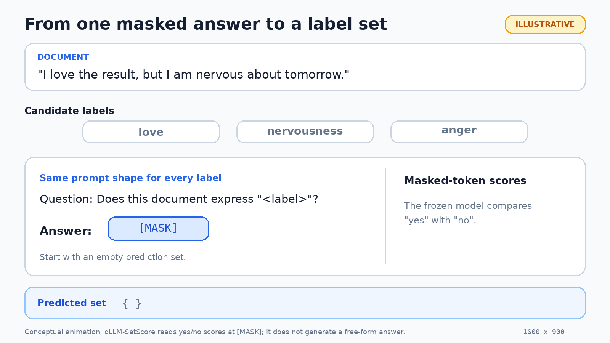
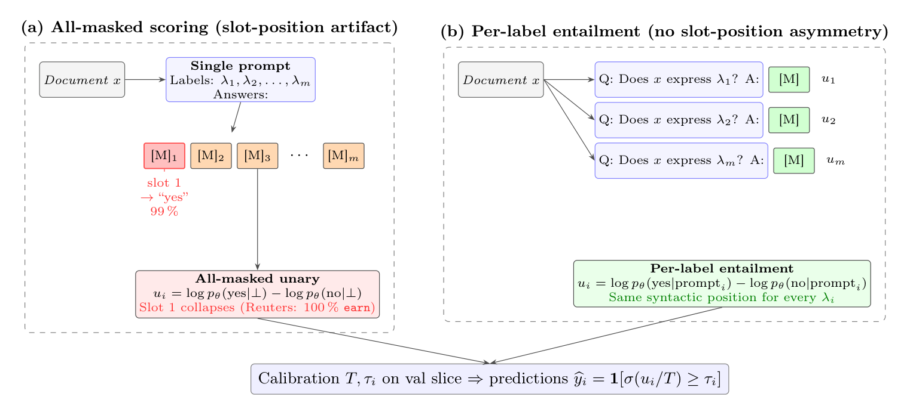

# 🧩 dLLM-SetScore

**TL;DR:** We use a diffusion language model to assign multiple labels to a document by asking one yes/no question for each label, without retraining the model.

### Three quick examples

| Input text | Illustrative label set |
|---|---|
| "Acme bought a rival and reported record quarterly earnings." | `acquisitions`, `earnings` |
| "I love the result, but I am nervous about tomorrow." | `love`, `nervousness` |
| "I will hurt you, you idiot." | `toxic`, `a threat`, `an insult` |

These examples show the task rather than saved outputs from the paper runs. The
actual prediction depends on the model, prompt, and calibrated thresholds.

### Watch one prediction unfold

<p align="center">
  
</p>
<p align="center"><em>Conceptual example with illustrative scores. The method compares yes and no at the masked answer position; it does not generate a free-form answer.</em></p>

**Want to know more?** Follow [how the scoring works](#-how-the-method-works),
see [what it reveals about diffusion models](#-why-this-is-interesting-for-diffusion-models),
or [reproduce a paper experiment](#-reproducing-the-paper-experiments).

> [!TIP]
> **🤠 From [AI Wranglers](https://aiwranglers.org/)**
>
> **Learn. Research. Play. Join our team!**
>
> AI Wranglers is a friendly one-stop place for learning AI, doing research,
> and turning ideas into useful applications. Curious newcomers, seasoned
> researchers, and enthusiastic tinkerers are all welcome. Bring your
> curiosity; cowboy hats and warehouse-sized GPU clusters are optional. 🙂

> A masked diffusion model, one yes/no question per label, and no
> task-specific backbone training. That is the whole idea. 🙂

Code for **"Discrete Diffusion Language Models Are Training-Free Multi-Label
Classifiers."**

## 🔍 How the method works

Given a document $x$ and a label inventory
$\Lambda = \{\lambda_1,\ldots,\lambda_m\}$, dLLM-SetScore evaluates each
candidate label independently:

1. It creates one short prompt per label, such as
   `Document: <text> Question: Does this document express <label>? Answer: [MASK]`.
   With $m$ candidate labels, the model processes $m$ prompts.
2. A frozen masked diffusion language model scores `yes` and `no` at the single
   masked answer position. It does not generate a free-form response or update
   its weights.
3. The label score is the log-odds
   $u_i = \log p(\text{yes}\mid\text{prompt}_i) - \log p(\text{no}\mid\text{prompt}_i)$.
   A larger score means that the document provides more support for that label.
4. The method applies temperature scaling and a threshold to each score:
   $\widehat y_i = 1$ when $\sigma(u_i/T) \geq \tau_i$. The temperature,
   threshold strategy, and prompt template are selected on a labelled
   200-example validation slice. Test labels are not used for these choices.

Every label appears in the same syntactic answer position. This makes the
predicted set independent of label ordering and avoids the slot-position
artifact found when all labels and masks are packed into one long prompt. It
does not remove biases caused by label wording or prompt choice, which is why
the validation protocol matters.

Here, "training-free" means that the diffusion backbone receives no
task-specific fine-tuning and the method uses no NLI training data. It does
not mean that the complete protocol is label-free: the small validation slice
is used for prompt selection and calibration.

<p align="center">
  
</p>
<p align="center"><em>All-masked scoring has a slot-position artifact; per-label entailment puts every label in the same answer position.</em></p>

## 🌀 Why this is interesting for diffusion models

Multi-label classification is a useful stress test for a diffusion language
model. A document can express several labels at once, so the output is a set
rather than one fluent answer. The model must make repeated, comparable
decisions about the same text.

Masked diffusion models learn to recover corrupted tokens. dLLM-SetScore asks
whether the probability at one masked `yes`/`no` position can serve as evidence
for each label. This simple setup exposes behavior that ordinary text
generation can make hard to notice:

- Prompt layout can dominate the score. In our experiments, packing every label
  into one long masked suffix creates a strong first-slot bias. Giving each
  label its own prompt removes this particular order effect.
- Semantic evidence and decision calibration are different jobs. The diffusion
  model supplies log-odds; validation data selects the prompt, temperature, and
  thresholds that turn those scores into a predicted set.
- Local consistency does not automatically produce better set predictions. The
  explored JSR updates sound reasonable but reduce F1, so a locally preferred
  label change need not improve the complete label set.

These results do not show that diffusion language models are universally
better classifiers. They show that denoising scores can be reused without
fine-tuning the backbone, and that multi-label prediction makes both useful
signals and model quirks visible label by label. That is the fun part: the
classifier doubles as a small microscope for the model. 🔬

## 🌟 Key results at a glance

Scores are the seed-13 micro-F1 / macro-F1 percentages from the camera-ready
paper. Prompt tuning and calibration use the 200-example validation slice,
never the test labels.

| | Setting | Micro / macro F1 |
|---|---|---:|
| 🙂 | GoEmotions, LLaDA-Instruct with the "feeling" prompt | **29.5 / 24.8** |
| 📰 | Reuters, LLaDA-Instruct with the "main topic" prompt | **80.5 / 68.8** |
| ⚖️ | ECtHR, LLaDA-Instruct with the default prompt | **48.8 / 43.3** |
| 💬 | Jigsaw, LLaDA-Instruct with the "contains" prompt | **45.1 / 28.5** |
| 🧪 | Reuters hybrid: BART + SetFit + LLaDA-Instruct | **82.4 / 79.3** |

The Reuters hybrid includes the few-shot supervised SetFit component, so it is
a reference result rather than a training-free method. Each metric pair comes
from one operating point.

The repository also includes the all-masked multi-slot scorer used for the
positional-asymmetry diagnostic, local Joint Set Refinement (JSR), calibration,
baselines, prompt sweeps, and multi-seed aggregation. Per-label scoring is the
recommended default; local JSR is included as a negative-result experiment.

> 📦 **Source-only release.** This repository excludes reported result files,
> predictions, datasets, caches, plots, logs, trained weights, and checkpoints.
> The commands below create local outputs under the Git-ignored `runs/`
> directory.

## 🗂️ Repository contents

```text
.
├── pyproject.toml
├── docs/figures/               # README visuals and their editable sources
├── src/dllm_setscore/
│   ├── core.py                 # datasets, models, scoring, calibration, metrics
│   ├── cli.py                  # main experiment and baseline CLI
│   └── config.py               # reusable defaults
└── scripts/
    ├── llada_per_label.py      # recommended per-label entailment scorer
    ├── llada_permuted_unary.py # all-masked permutation diagnostic
    ├── jsr_from_unary.py       # local-JSR negative-result experiment
    ├── bart_template_search.py # BART-MNLI validation template search
    ├── ensemble_sweep.py       # post-hoc convex ensemble analysis
    ├── recalibrate.py          # calibration ablation over saved predictions
    ├── aggregate_seeds.py      # mean/std across seeded runs
    ├── final_summary.py        # compact Markdown result summary
    ├── make_positional_bias_plot.py
    ├── check_components.py
    └── show_results.py
```

The large development notebook, manuscript-build scripts, upload utilities,
and machine-specific maintenance tools are not needed to reproduce the
experiments and are not included.

## 🛠️ Environment

The paper experiments used:

- Python 3.10 or newer
- one NVIDIA RTX 5090 with 32 GB VRAM
- PyTorch 2.11 with CUDA 12.8
- Transformers 4.49
- bfloat16 inference for LLaDA-8B and Dream-7B
- seed 13 for headline runs, with seeds 17 and 23 for replication

Create an isolated environment:

```bash
git clone https://github.com/misterpawan/multilabel-classification-dllm-paper.git
cd multilabel-classification-dllm-paper

python3 -m venv .venv
source .venv/bin/activate
python -m pip install --upgrade pip

# Select the PyTorch wheel appropriate for your CUDA installation.
pip install --index-url https://download.pytorch.org/whl/cu128 "torch==2.11.*"
pip install -e . "transformers==4.49.*"
```

The diffusion models are downloaded from Hugging Face on first use. Set
`HF_HOME` to a writable location with enough free space. This explicit setting
also avoids inheriting a machine-wide cache path that the current user cannot
write:

```bash
export HF_HOME="$PWD/runs/huggingface"
mkdir -p "$HF_HOME"
```

If your Hugging Face account or a model requires authentication, set
`HF_TOKEN` in the shell. Never commit that token.

Check the installation without downloading a model:

```bash
python -m compileall -q src scripts
python -m dllm_setscore --help
PYTHONPATH=src python scripts/check_components.py
```

## 📚 Datasets

Five datasets are fetched by Hugging Face Datasets when first requested:

- GoEmotions: `google-research-datasets/go_emotions`
- Reuters-21578: `Tellurio/reuters-21578` (ModApte, top 20 topics)
- EURLEX57K: `coastalcph/lex_glue`, configuration `eurlex`
- ECtHR Task A: `coastalcph/lex_glue`, configuration `ecthr_a`
- Jigsaw Toxic Comment Classification:
  `thesofakillers/jigsaw-toxic-comment-classification-challenge`

AAPD is downloaded separately:

```bash
mkdir -p data/aapd
curl -L https://zenodo.org/records/6344750/files/AAPD.zip -o /tmp/AAPD.zip
unzip /tmp/AAPD.zip -d data/aapd
```

The loader expects `data/aapd/train.csv`, `data/aapd/dev.csv`, and
`data/aapd/test.csv`. Dataset files are ignored by Git.

The result-producing protocol uses the following validation sources, test
sources, and caps. A cap is applied after the dataset loader has constructed
the split.

| Dataset | Validation source | Test source | Validation cap | Test cap | Scored labels |
|---|---|---|---:|---:|---:|
| GoEmotions | official validation | official test prefix | 200 | 1500 | 28 |
| Reuters-21578 | seeded 10% split of ModApte training data | ModApte test prefix | 200 | 1500 | top 20 |
| EURLEX57K | official validation | official test prefix | 200 | 800 | SBERT shortlist of 32 from 100 |
| ECtHR Task A | official validation | official test split | 200 | 1000 | 10 |
| Jigsaw Toxic | seeded split of the labeled training release | seeded test pool | 200 | 1500 | 6 |
| AAPD | official development split | official test split | 200 | 1000 | 54 |

For GoEmotions, EURLEX57K, ECtHR, and AAPD, changing `DLLM_SEED`
does not change the official validation or test prefix. Reuters uses the seed
when constructing its validation split. Jigsaw uses it when constructing both
validation and test pools. Use seed 13 for the headline rows.

Verify dataset loading with a small command:

```bash
python -m dllm_setscore \
  --mode describe \
  --datasets goemotions reuters21578_top20
```

## 🧪 Reproducing the paper experiments

All commands below write new files below `runs/main`. No precomputed scores or
reported results are required.

### 1. Recommended per-label scorer

Run LLaDA Base and Instruct:

```bash
datasets=(goemotions reuters21578_top20 eurlex57k ecthr_a jigsaw_toxic aapd)
test_caps=(1500 1500 800 1000 1500 1000)

for i in "${!datasets[@]}"
do
  dataset="${datasets[$i]}"
  test_cap="${test_caps[$i]}"
  for backbone in llada llada_instruct
  do
    DLLM_SEED=13 python scripts/llada_per_label.py \
      --datasets "$dataset" \
      --backbone "$backbone" \
      --root runs/main \
      --max-val-examples 200 \
      --max-test-examples "$test_cap" \
      --batch-size 64
  done
done
```

Run the independent Dream-7B Base/Instruct replication:

```bash
datasets=(goemotions reuters21578_top20 eurlex57k ecthr_a jigsaw_toxic aapd)
test_caps=(1500 1500 800 1000 1500 1000)

for i in "${!datasets[@]}"
do
  dataset="${datasets[$i]}"
  test_cap="${test_caps[$i]}"
  for backbone in dream dream_instruct
  do
    DLLM_SEED=13 python scripts/llada_per_label.py \
      --datasets "$dataset" \
      --backbone "$backbone" \
      --root runs/main \
      --max-val-examples 200 \
      --max-test-examples "$test_cap" \
      --batch-size 64
  done
done
```

The script verifies that the `yes` and `no` verbalizers are single tokens,
tunes calibration on the validation slice, and evaluates the resulting
thresholds on the test slice. Batch size changes throughput and memory use, not
the validation-selected decision rule.

### 2. BART-MNLI and SetFit baselines

```bash
datasets=(goemotions reuters21578_top20 eurlex57k ecthr_a jigsaw_toxic aapd)
test_caps=(1500 1500 800 1000 1500 1000)

for i in "${!datasets[@]}"
do
  python -m dllm_setscore \
    --mode main \
    --datasets "${datasets[$i]}" \
    --backbones llada \
    --include bart_mnli setfit \
    --root runs/main \
    --max-val-examples 200 \
    --max-test-examples "${test_caps[$i]}"
done
```

Search BART-MNLI templates on the validation subset:

```bash
datasets=(goemotions reuters21578_top20 eurlex57k)
test_caps=(1500 1500 800)

for i in "${!datasets[@]}"
do
  PYTHONPATH=src python scripts/bart_template_search.py \
    --datasets "${datasets[$i]}" \
    --root runs/main \
    --max-val-examples 200 \
    --max-test-examples "${test_caps[$i]}"
done
```

SetFit is a few-shot supervised baseline, not a training-free method.

### 3. All-masked scorer and positional asymmetry

Generate the all-masked unary and local-JSR runs:

```bash
python -m dllm_setscore \
  --mode main \
  --datasets goemotions reuters21578_top20 \
  --backbones llada \
  --include dllm \
  --root runs/main \
  --max-val-examples 200 \
  --max-test-examples 1500
```

Run the label-permutation diagnostic:

```bash
PYTHONPATH=src python scripts/llada_permuted_unary.py \
  --datasets goemotions reuters21578_top20 \
  --root runs/main \
  --max-val-examples 200 \
  --max-test-examples 1500 \
  --n-permutations 4
```

Plot an all-masked prediction artifact:

```bash
PYTHONPATH=src python scripts/make_positional_bias_plot.py \
  --predictions \
    runs/main/results/predictions/<run-directory>/predictions.npz \
  --dataset goemotions \
  --out runs/main/plots/positional_bias.png
```

Use a real generated directory in place of `<run-directory>`.

### 4. Prompt-template sensitivity

`llada_per_label.py` accepts any format string containing `{label}`:

```bash
DLLM_SEED=13 python scripts/llada_per_label.py \
  --datasets reuters21578_top20 \
  --backbone llada_instruct \
  --root runs/main \
  --question-template $'\n\nQuestion: Is the main topic of this article {label}?\nAnswer:' \
  --method-suffix topic \
  --max-val-examples 200 \
  --max-test-examples 1500 \
  --batch-size 64
```

Use analogous dataset-appropriate templates for the GoEmotions and Jigsaw
sweeps. Template selection must use validation performance only.

### 5. Multi-seed replication

The paper uses seeds 13, 17, and 23:

```bash
for seed in 13 17 23
do
  DLLM_SEED="$seed" python scripts/llada_per_label.py \
    --datasets goemotions reuters21578_top20 ecthr_a \
    --backbone llada_instruct \
    --root runs/main \
    --method-suffix "seed${seed}" \
    --max-val-examples 200 \
    --max-test-examples 1500 \
    --batch-size 64
done

PYTHONPATH=src python scripts/aggregate_seeds.py --root runs/main
```

### 6. Calibration and ensemble analysis

These commands operate only on predictions generated locally by the earlier
steps:

```bash
PYTHONPATH=src python scripts/recalibrate.py \
  --root runs/main \
  --strategies global labelwise expected_cardinality \
  --out runs/main/tables/recalibrated.csv

PYTHONPATH=src python scripts/ensemble_sweep.py \
  --root runs/main \
  --out runs/main/tables/ensemble.csv
```

Do not use the test labels to choose a prompt, calibration strategy, or
ensemble. The 200-example validation slice is the selection set; test data is
for the final report only.

## 📦 Output layout

Each command records its configuration and generated predictions below:

```text
runs/main/
├── cache/
├── results/
│   ├── main_results.jsonl
│   └── predictions/<dataset>_<method>_<config-hash>/
│       ├── config.json
│       └── predictions.npz
├── plots/
└── tables/
```

These paths are reproducibility products, not source files, and are excluded
from version control.

## ✅ Reproducibility notes

- Set `DLLM_SEED` before starting each process. The default is 13.
- Keep `--max-val-examples 200` for the paper protocol.
- Use the per-dataset test caps in the protocol table. A single cap for the
  complete suite does not reproduce the result-producing slices.
- Prompt choice, calibration strategy, temperature, thresholds, and ensemble
  weights must be selected on validation data. Test labels are used only for
  the final report.
- EURLEX57K uses an SBERT shortlist of 32 labels; the other reported datasets
  use their full label inventories.
- Model repositories use `trust_remote_code=True`. Review the downloaded
  model code and pin model revisions for archival replication.
- Record the Git commit, model and dataset revisions, command, seed, GPU, and
  package versions for every archival run.

## 🧹 Artifact policy

Do not commit:

- `runs/`, `results/`, predictions, score arrays, or generated tables
- datasets or Hugging Face caches
- model weights, checkpoints, or optimizer states
- logs, plots, notebooks with embedded output, or temporary files
- credentials or environment files

The `.gitignore` enforces these exclusions.

## 📝 Citation

```bibtex
@inproceedings{kumar2026dllmsetscore,
  title     = {Discrete Diffusion Language Models Are Training-Free Multi-Label Classifiers},
  author    = {Pawan Kumar},
  booktitle = {Proceedings of the 2026 SIAM International Conference on Data Mining},
  year      = {2026}
}
```

## 📄 License

The code is distributed under the Apache License 2.0. Datasets and pretrained
models retain their original licenses and terms.
